# 3DCG 基礎概念講習会 応用編

担当:@d_etteiu8383

---

# 担当自己紹介

名前：d_etteiu8383(でっていう)
所属：グラフィック班とゲーム班

キャラモデリングをメインに活動
トゥーン表現/NPR に興味があります

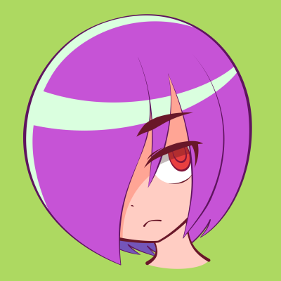

---

# 内容

- 対象者：3DCG**初心者**:beginner:
  - 3DCG 作品を作りたい人
  - 3D を用いたゲームを作りたい人
- **実際**の 3DCG 制作の**全体像**を知る

# 注意

- 今回話すのは基礎知識のみ
- 質問をガンガン投げてください

カタカナがいっぱい出てきますが全部覚える必要はありません。いつか「聞いたことあるな」になれば OK です。
後はひたすらググったり質問してください。

<!-- 対象者は3DCGの初心者としていて、3DCGを用いた作品を作りたい人や、3Dを用いたゲームを作りたい人に聞いてほしい内容になっています。また、今回は3DCG制作の全体像を何となく知ることを目標にお話して行きます。基礎知識のみに焦点を当てて話すので、より詳しいことは太字で示した重要単語でひたすらググってください。また、実況チャンネルで質問を常に募集します。適当なタイミングでお答えします。今日の資料の中にはカタカナの単語がいっぱい出てきますが全部覚える必要はありません。 -->

---

# 今日の予定

1. 3DCG で**何が**できるの？
2. 3DCG は**どう**作るの？
3. 3DCG は**何で**作るの？
4. 質疑応答

<!-- まず3DCGで何ができるのかを、次に3DCGは具体的にどうつくるのか、最後に3DCGを作るために必要になるもの、何で作るのかを説明したいと思います。加えて、事前に募集した質問や相談、あるいは配信中に寄せられた質問に答える時間を最後に設けています。 -->

---

<!-- header: "第一章 3DCGで何ができるの?" -->

# 3DCG で**何が**できるの？

## 定義

3DCG とは

> コンピュータの演算によって 3 次元空間内の仮想的な立体物を 2 次元である平面上の情報に変換することで奥行き感（立体感）のある画像を作る手法
> <small>(引用 https://ja.wikipedia.org/wiki/3%E6%AC%A1%E5%85%83%E3%82%B3%E3%83%B3%E3%83%94%E3%83%A5%E3%83%BC%E3%82%BF%E3%82%B0%E3%83%A9%E3%83%95%E3%82%A3%E3%83%83%E3%82%AF%E3%82%B9)</small>

である。

## アイスブレイク:icecream:

"3DCG"と聞いて思い浮かべるものや知っていること、"3DCG"でやってみたいこと(やってみたいと思ったきっかけ)を呟こう。

<!-- まずそもそも3DCGとは、{引用}である。とされています。簡単に言うと、立体物を2次元の画像に変換することです。まず、今回の講習会に参加している方にとっての3DCGや、何を知っていて/何を知らないのかを知りたいので、{アイスブレイク}実況チャンネルに投稿してみてください。タイムラグがあると思うので、先に"僕が思う3DCGを少し話したいと思います。" -->

---

<!--
_class: no-header no-footer
-->

著作権的にアレなので画像削除済み(サークル内限定で公開)

<!--  -->

<!-- まず左上、これは現在放送されている『トロピカル～ジュ！プリキュア 』のエンディング映像です。プリキュアでは2009年に放送された『フレッシュプリキュア』の時代からエンディングに3DCGを利用したダンス映像を使用していて、僕が3DCGに興味を持つきっかけになった作品でもあります。 -->

<!-- 同じように右下の『プリパラ』というアニメでは劇中のライブシーンのみ3DCGで表現すると言ったことがされており、ダンスモーションの使いまわし等が行われています。 -->

<!-- 映像作品という視点では、右下のヨルシカさんの『だから僕は音楽を辞めた』という曲のMVにも3DCGが使われています。後でもお話しますがこれはBlenderというソフトで作られています。 -->

<!-- 3DCGは映画でも使われていて、アベンジャーズみたいな、実際の映像にエフェクトを追加する目的で3DCGを利用することも良くあります。 -->

<!-- 映像作品の中では少し特殊な位置にありますが、近年はVtuberという形で、動画作成者、配信者が3Dキャラクターモデルを身にまとって動画内に登場すると言ったことも増えました。これはVtuberのキズナアイですね。 -->

<!-- 3DCGはもちろんゲームにも使われます。『スーパーマリオ64(ろくじゅうよん)』をはじめとして、ニンテンドー64(ロクヨン)よかPS1の時代から3Dゲームも一般的な物になっていて、今ではほとんどのゲームで3DCGが用いられています。最近発売した有名作品としては、スーパーマリオ3Dワールドや、モンハンがあります。 -->

<!-- さらにはモバイル機器の技術進歩に伴って、据え置きのゲーム機だけではなくスマートフォンでも3DCGを用いたゲームが一般的になってきています。ここに挙げた例では、デレステやミリシタ、最近話題のウマ娘も3Dゲームですね。 -->

<!-- 真ん中のは僕が新刊ビラように作ったイラストですが、このようにモニターに映し出されるコンテンツだけではなく、紙媒体でもイラストとして3DCGを用いることは多々あります。 -->

<!-- ここでみんなのアイスブレイクを拾う -->

---

## できる**もの**：**画像**(映像)

途中で触るものは 3D モデルだったりソースコードだったりするけど、最終的にできる物は**画像**。

## できる**こと**：**全部**...?

- 物理的に正しい(=リアルな)描写
  - 重力や物体の衝突のシミュレーションなど。
- 嘘の描写
  - 現実の物体ではなくデータを扱うので嘘をつける(影を付けない、空飛んでるなど)。
  - "輪郭線"など現実の物体にはない要素も計算等により表現できる。

やろうと思えば何でもできる(と思ってる)。

<!-- まず意識してほしいのは、3DCGは最終的に画像を作る技術だということです。この後にも話しますが映像も画像のあつまりです。途中の形がどんなものであれ、最終的に我々の目に届くときには絶対に画像になっています。 -->

<!-- また、どんなことができるのかと聞かれたら、僕は何でもできる、全部できると答えています。{リスト内}もっというとコンピュータに計算できることは、全部できるという感じですが、発想次第でどんなことでもできると考えています。 -->

---

## 具体例

- ゲーム
  - 操作に応じて**リアルタイム**に映像が変化する。(モンハンや 3D マリオ)
  - 武器や衣装の変更による**容姿の変化**が比較的容易に表現できる。(モンハンやウマ娘)
- 広告
  - **嘘をついて**製品をよりよく見せる。(車や家電の CM)
- アニメ
  - ダンスシーン等**動きの激しい絵**を比較的容易に、**破綻を少なく**表現できる。(プリパラを観ろ)
  - 中割り作成が比較的楽。(手描きでは大変)

<!-- 分かりやすい具体例をいくつかここに上げます。
{リスト}
いくらでも利点はあるのでここに挙げたものに限らず発送次第で便利な使い方はいくらでもできます -->

---

## みんなの願望

かなり前に取ったアンケートの結果です([3D モデリングをやっている・やりたい理由・目的 | anke-to](https://anke-to.trap.jp/results/501))。

- 一次創作キャラを立体にして遊びたい
  - 3DCG は実質お人形遊び
  - 映像向けにもゲーム向けにも使いまわしが効きやすいのは 3DCG の特権
- 自作アバターで VR ゲームがやりたい
  - これがスタンダードになる時代がすぐそこまで来てる(Craftopia)。
  - 統一されたフォーマットの元、外見だけ異なるアバターを各個人が自由に設定して遊ぶことができる、みたいなことは CG の特権。

- 絵の参考資料にしたい/3D をイラストに持ち込みたい
  - 最近はこの手法使ってる人良く見かける
- ひらひらした服の動きを眺めていたい
  - 物理演算も 3DCG の特権
- XR やりたい
  - 現実と嘘を混ぜるのはめちゃくちゃ楽しい
  - [Unity + RedSpy(トラッキングシステム) + Reality Engine(CG 合成ソフト)による KizunaAI のライブ](https://2020hello.world/)
- 美少女になりたい(3 人重複回答)
  - なれます

<!-- Craftopiaでは現在VRMという形式の3Dモデルを読み込んで自分のアバターとして使用できます。これはもともとVRMmodっていうmodの機能だったのですが、このmodの開発者がゲームの開発チームに合流して公式機能になりました。 -->

---

<!-- header: "第二章 3DCGはどう作るの?" -->

# 3DCG は**どう**作るの？

> 3 次元空間内の仮想的な立体物を 2 次元である平面上の情報に変換する

ことで作る。

一般的な 3DCG 制作ではだいたいこんな流れ。

1. **立体物**を用意する
2. (動画を作る場合は)立体物を**動かす**
3. **カメラ**や**ライト**等の準備
4. **画像**に**変換**する
5. エフェクト等で**調整**

<!-- 先ほど定義としてお話した通り、{>3次元空間...}ことで作ります。もっとちゃんと言うと、{...} -->

---

<!-- header: "第二章 3DCGはどう作るの? > 立体物を用意する" -->

# 1. **立体物**を用意する

"立体物"のことを一般的に**3D モデル**(3D model)と呼ぶ。
これを作る過程が**モデリング**(modeling)。

本来"3D モデリング"と言う時は"立体物の作成過程"のみを指すので、立体物を動かしたり画像への変換まで行った"3D モデリング体験会"や、モデリング部は呼称として不適切だったりする。

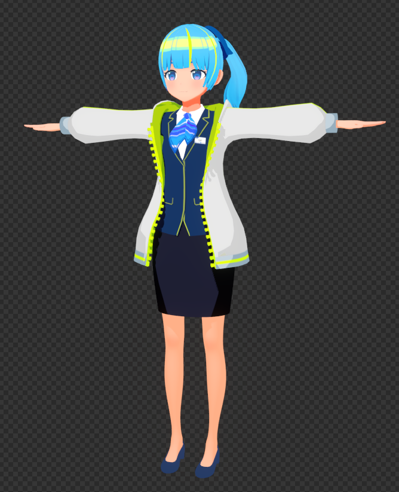

<!-- まず3DCGは立体物を用意することから始まります。この立体物を3Dモデルを呼び、これを作ることを3Dモデリングと言います。 -->

---

# 1. **立体物**を用意する

3D モデルの構成要素は大きく分けて**ポリゴンメッシュ**と**マテリアル**の 2 つ。

<figure>
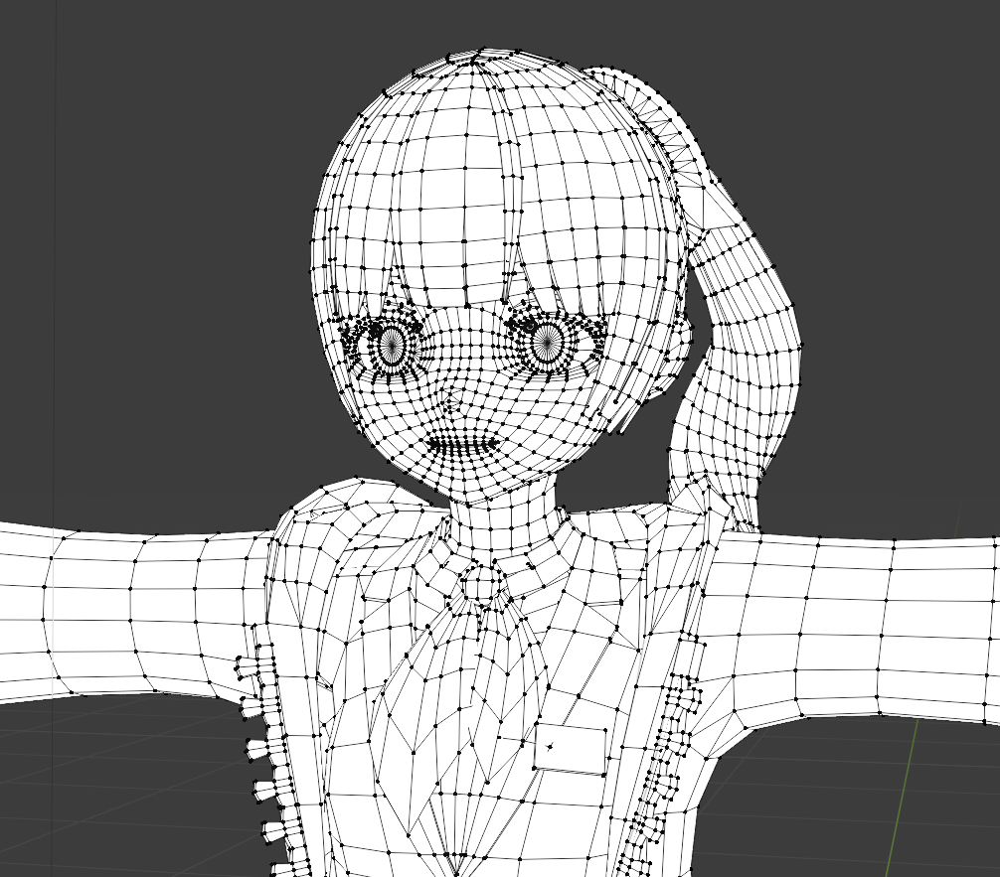
<figcaption>ポリゴンメッシュ</figcaption>
</figure>
<figure>
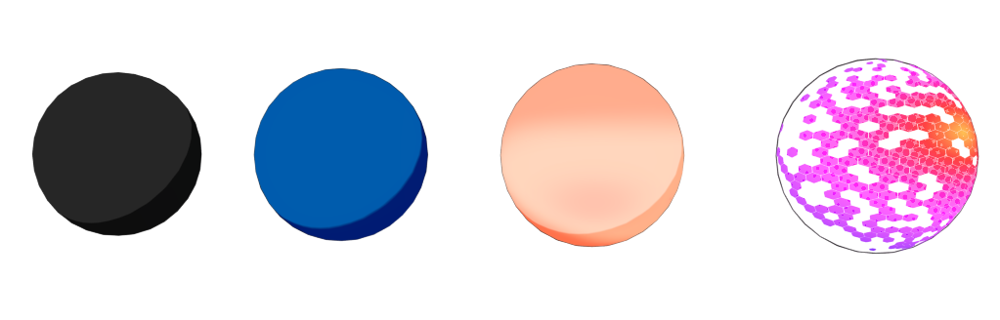
<figcaption>マテリアル</figcaption>
</figure>

---

<!-- header: "第二章 3DCGはどう作るの? > 立体物を用意する > ポリゴンメッシュ" -->

## ポリゴンメッシュ

立体物の**形**は**ポリゴンメッシュ**(polygon mesh)
...つまり**多角形**の**網目**で表現される。
ポリゴンメッシュはさらに以下の 3 つの要素で構成される。

- **頂点**(Vertex)
  - 位置のデータ(3 次元)を持つ点
- **辺**(Edge)
  - 2 つの頂点間を結んだ線
- **面**(Face)
  - 3 つ以上の辺で囲まれた多角形

頂点

辺

面

<!-- まず一つ目の構成要素はポリゴンメッシュです -->

---

<!-- header: "第二章 3DCGはどう作るの? > 立体物を用意する > ポリゴンメッシュ > 具体例" -->

### 新歓ビライラストにおける具体例

黒い点が**頂点**、黒い線が**辺**、白い部分は**面**。

このように頂点や面を追加したり、
位置を調整してポリゴンメッシュを作るのが
モデリングの第一段階。

**三角形?四角形?**
Q. 平面を一意に定めるには 3 つの頂点(三角形)が必要。
でもよく見かける 3D モデルは四角形の面で構成されている。結局どっちを使うの?

A. モデリング時は四角形で扱う(操作しやすいので)。
処理時は内部で勝手に三角形として計算してくれる。
五角形以上の面があると不具合が発生することが多い。

---

<!-- header: "第二章 3DCGはどう作るの? > 立体物を用意する > ポリゴンメッシュ > 法線" -->

### 法線

**法線**(normal)は面の向きの情報のこと。

光の反射、影の計算等に使われる。

頂点の位置から自動で設定される要素なので初心者のうちはあまり意識する必要はないが、これを自分で設定できるようになると作品のクオリティがぐっと上がる。
→ ノーマルマップ/法線マップ で検索

また、「影の付き方がおかしい」等の問題はだいたい法線の問題。

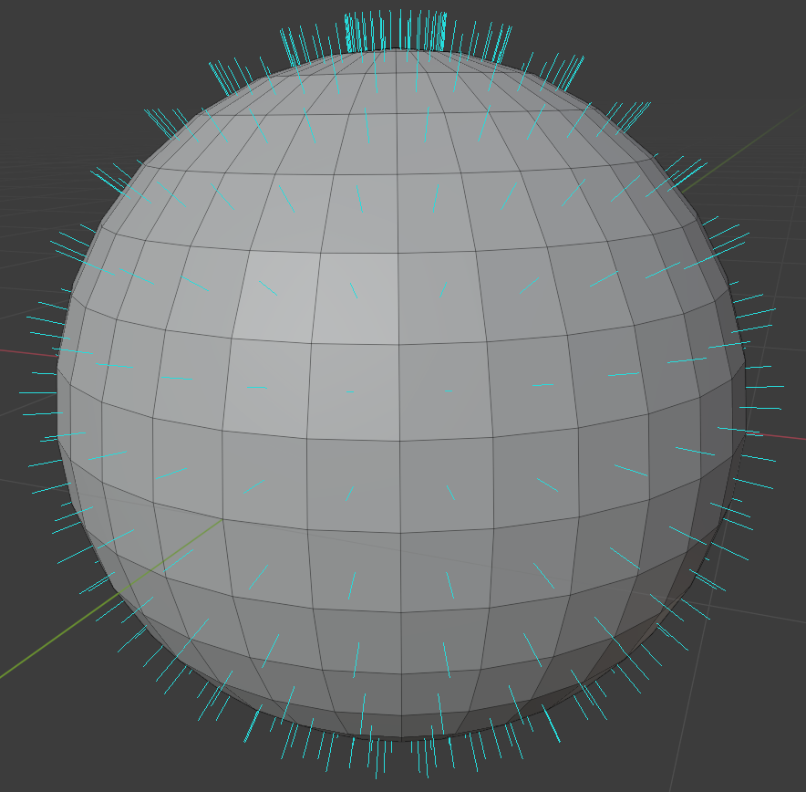

---

<!-- header: "第二章 3DCGはどう作るの? > 立体物を用意する > マテリアル" -->

## マテリアル

立体物の**材質**を規定するのが**マテリアル**(material)。

マテリアルは、**材質に関する設定**をまとめたもの。

- 色(アルベド/ベースカラー)
  - どんな光を反射するか?
- 表面の粗さ(ラフネス/スムースネス)
  - ざらざら？つるつる？
- 金属っぽさ(メタリック)

などの**描画に必要な情報**(数値)と、
**シェーダー**を内包している。

  

    シェーダー: スタンダード 
    色: (0.5, 1.0, 1.0) 
    粗さ: 0.5 
    などなど...
  

  

    
  

  

    シェーダー: トゥーン 
    色: (1.0, 0.5, 0.5) 
    粗さ: 0.0 
    などなど...
  

  

    
  

  

    シェーダー: スタンダード 
    色: <code>greenNoise.png</code> 
    粗さ: 0.5 
    などなど...
  

  

    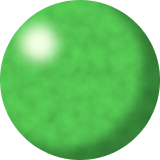
  

---

<!-- header: "第二章 3DCGはどう作るの? > 立体物を用意する > マテリアル > シェーダー" -->

### シェーダー

**シェーダー**(shader)は、各設定の値をもとに、**描画色を計算するスクリプト**\*。

"色(0.0, 0.9, 0.9), 粗さ 0.5, メタリック 0"で白い光がこっちの方から当たっているから反射を計算して...このピクセルの色は"(0.5, 1.0, 1.0)"だ！

って感じのことをしている。

<small>\*:"色を計算"とだけ言うと誤解を生むかもしれないがここでは省略(頂点シェーダ―/フラグメントシェーダーで検索)</small>

シェーダーは**がっつりプログラミング**の領域なので、「お絵描きはできないけどプログラミングできるのでこれで芸術作品作る」みたいな人もいっぱいいる → "[#つぶやき GLSL](https://twitter.com/search?q=%23%E3%81%A4%E3%81%B6%E3%82%84%E3%81%8DGLSL&src=typed_query)"などでググるとおもしろい

シェーダーについて詳しい話をしようとするとそれだけで講習会が 5 個ぐらい必要になるので、より詳しい話を知りたい方はググるか sodan に投げるか ~~phi16 さんに訊いてください~~...

ググりワード：シェーダー, 頂点シェーダ―, フラグメントシェーダー, GLSL

---

### シェーダー

基本的には普通に(現実世界と同じように)描画色を計算するシェーダーが使われるが、場合によっては特別なシェーダーを用意する。

- よくあるシェーダー
  - 物体の色や特性(金属感、粗さ)、面の向きをもとに光や影を計算するシェーダー。
- トゥーンシェーダー(アニメチックなシェーダー)
  - 輪郭線を描いたり、影の境界線をはっきり描くようなシェーダー。
- 屈折/液体を表現するシェーダー
  - 普通の光の反射とは違う計算を取り入れる必要があったりするシェーダー。

...などなど

プログラマーの技量次第でいくらでも楽しいシェーダーが作れる。

---

<!-- header: "第二章 3DCGはどう作るの? > 立体物を用意する > マテリアル" -->

## マテリアル

モデリングでは、マテリアルの設定値を**部分的に**変えたいという場合がある(というかほぼ確実に必要になる)。

<figure>
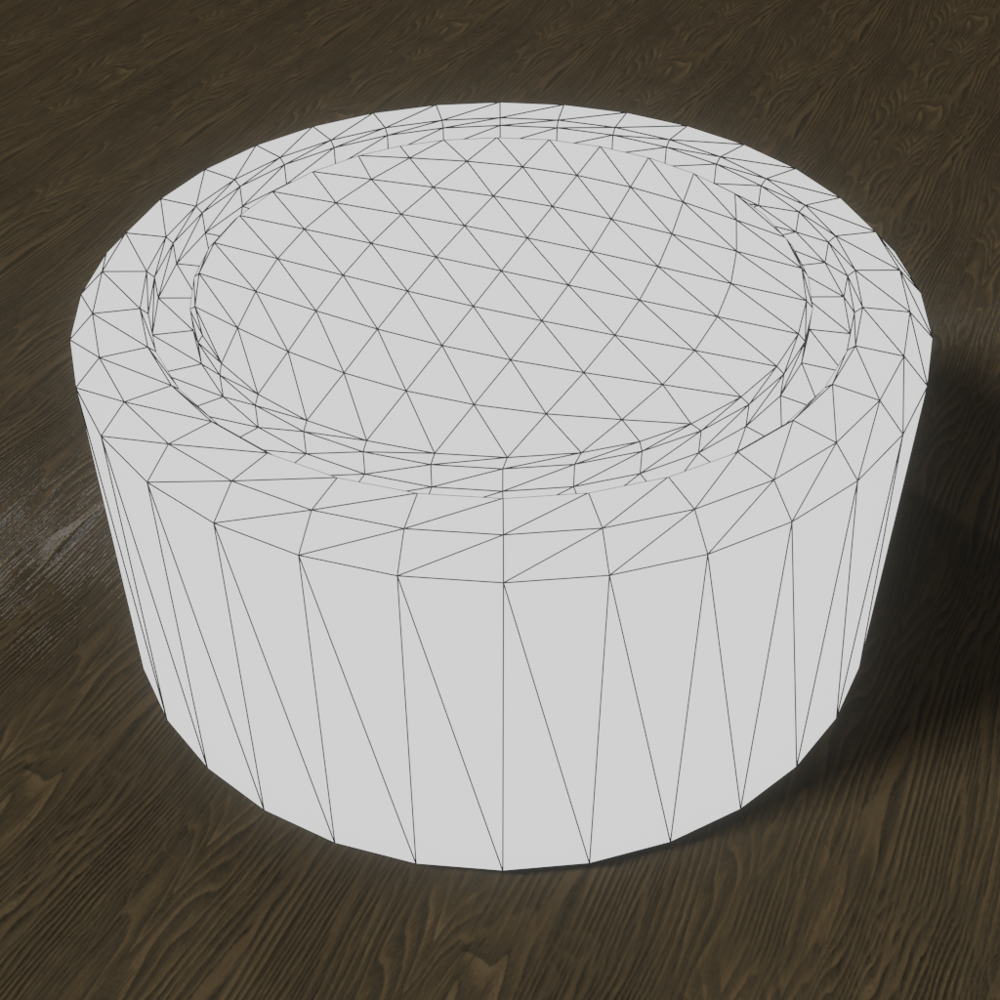
<figcaption>元のポリゴンメッシュ</figcaption>
</figure>
<figure>
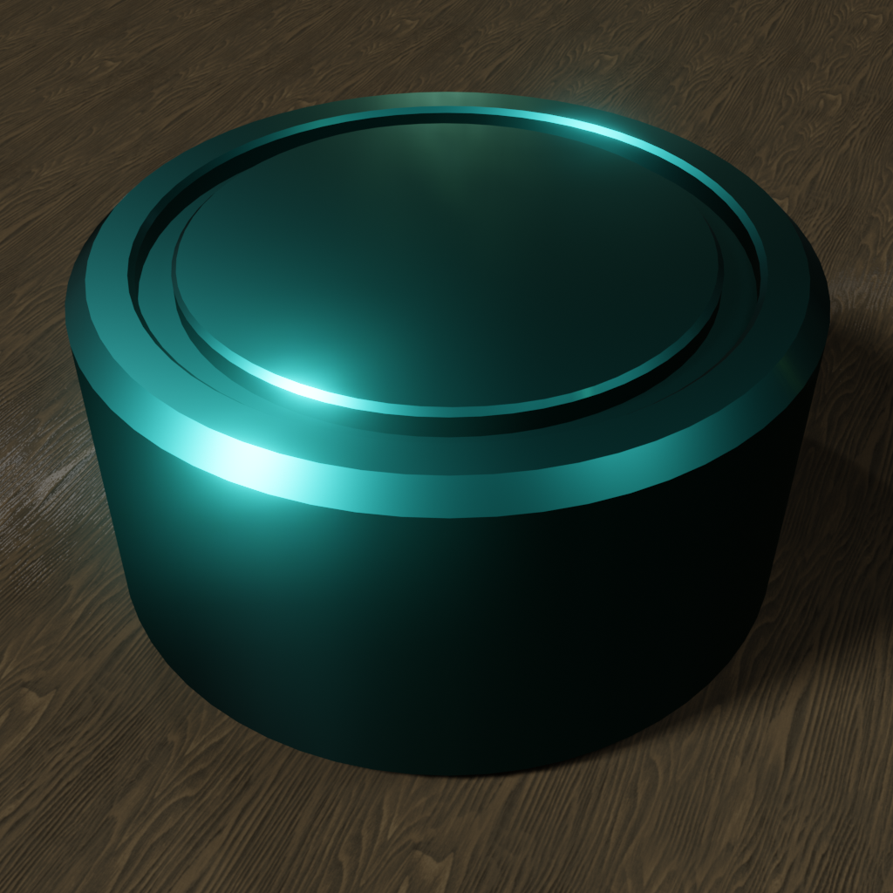
<figcaption>全体に一様な設定をした例</figcaption>
</figure>
<figure>

<figcaption>細かく色や金属感を変えた例</figcaption>
</figure>

これを実現するために、**テクスチャ**と**UV 座標**を使う。

---

<!-- header: "第二章 3DCGはどう作るの? > 立体物を用意する > マテリアル > テクスチャ" -->

### テクスチャ

**テクスチャ**は、ポリゴンメッシュの面内で柔軟にマテリアルの設定値( = モデル表面の状態)を変化させるために用いる**画像データ**。

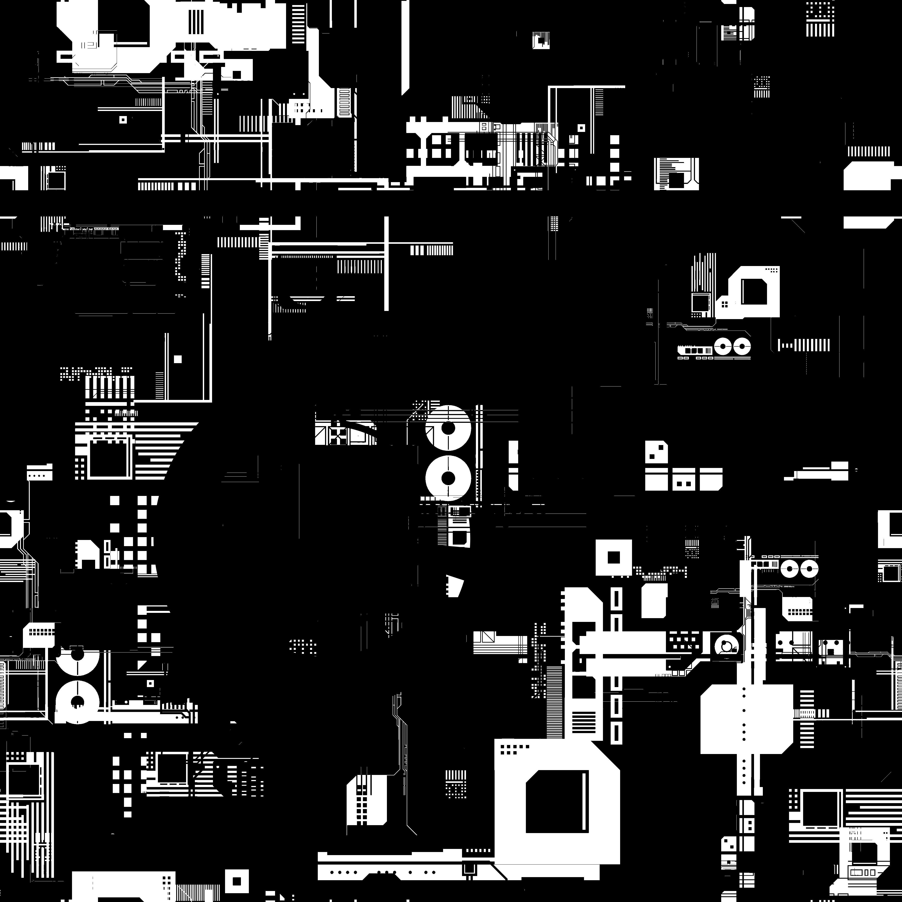

これをポリゴンメッシュの表面に"貼り付ける"ことで、細かな値の調整をする。
→"貼り付け方"を指定する必要がある。

---

<!-- header: "第二章 3DCGはどう作るの? > 立体物を用意する > ポリゴンメッシュ > UV座標" -->

## ポリゴンメッシュ

### UV 座標

**UV 座標**は、面とテクスチャの**どこを対応させるか**を指定する**2 次元の座標データ**。

UV 座標を設定することを
**UV 展開**と呼ぶ。

横方向の軸が U、
縦方向の軸が V。

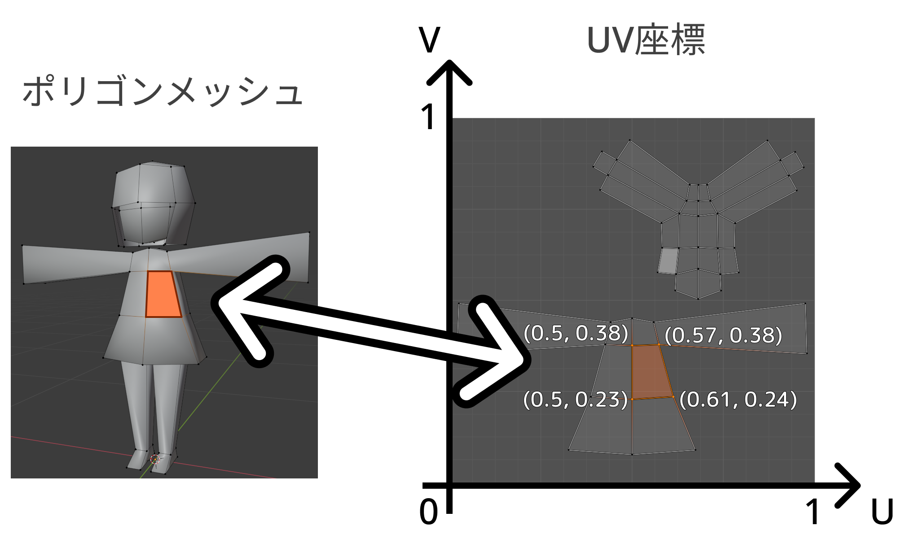

---

<!-- header: "第二章 3DCGはどう作るの? > 立体物を用意する > マテリアル > テクスチャ" -->

## マテリアル

### テクスチャ

メッシュに対してテクスチャを貼り付けて色や質感を表現することを**テクスチャマッピング**という。

↓ テクスチャを、UV 座標をもとに貼り付けた結果。

  <figure>
    
    <figcaption>元のメッシュ</figcaption>
  </figure>
  <figure>
    
    <figcaption>UV展開した結果</figcaption>
  </figure>
  <figure>
    
    <figcaption>貼り付けるテクスチャ 各ピクセルに0~1の値を持っている</figcaption>
  </figure>
  <figure>
    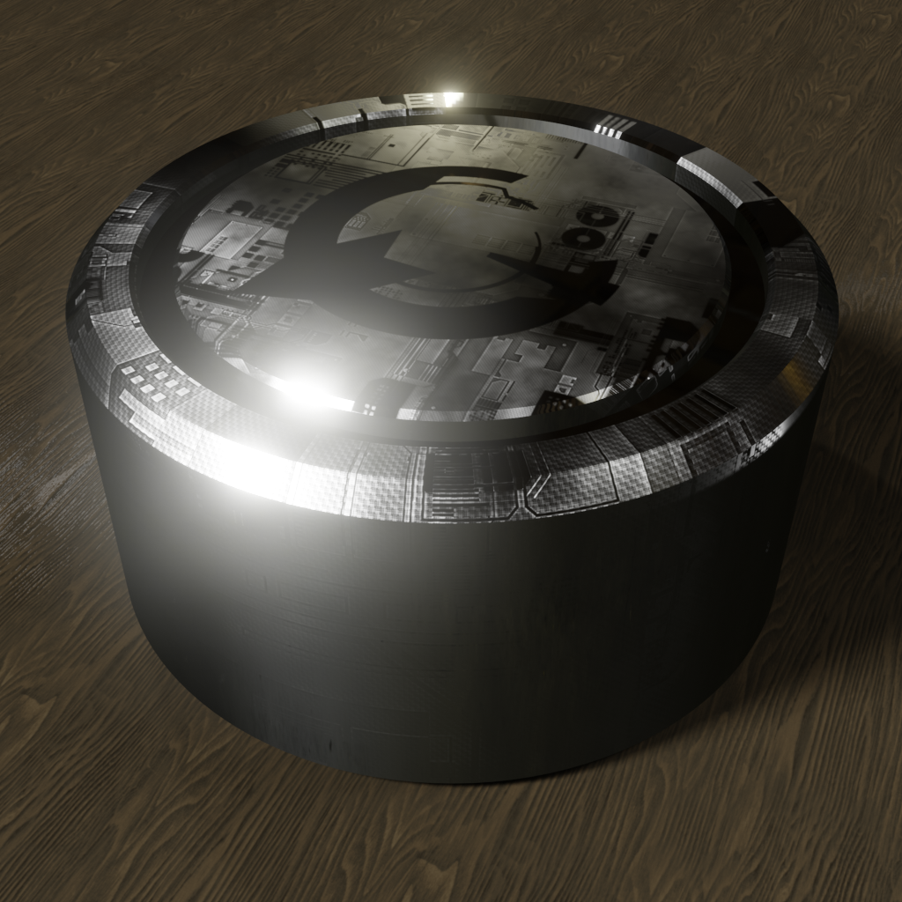
    <figcaption>"粗さ"に左のテクスチャを設定した結果</figcaption>
  </figure>

---

テクスチャは**色**を指定するもの**ではない**。
テクスチャは、シェーダーの**各設定値のためのデータ配列**にすぎない。
たしかに画像は色の情報を持っているデータだが、3DCG では**便利なデータの配列**として扱う。(`float[,,3]`)
具体例(作られたシェーダーの設定項目の数だけテクスチャが存在するので名称は定まっているわけではない ここで挙げているのは同様の機能を持つシェーダーで一般的に呼ばれている名称)

- カラーマップ/デフューズマップ/アルベドマップ
  - 色を設定することができるシェーダーに対して、色情報を与える画像データ。
- バンプマップ
  - 表面を疑似的に隆起しているように見せることができるシェーダーに対して、隆起具合を与える画像データ(与えられた数値をもとに、法線を変更している)
- 法線マップ/ノーマルマップ
  - 表面の法線情報を変更することができるシェーダーに対して、法線情報を与える画像データ(RGB の 3 データと xyz の 3 データを対応させることができるので都合がいい)
- マスク
  - 複数の設定を切り替えることができるシェーダーに対して、どの設定に切り替えるかを与える画像データ(ゲームなどでよく用いられる(状況によって服の一部を汚すなど(ウマ娘)))

---

<!-- header: "第二章 3DCGはどう作るの? > 立体物を用意する > マテリアル > 具体例" -->

### 新歓ビライラストにおける具体例

ポリゴンメッシュに対してこれらのマテリアルを割り当てて材質を設定するのがモデリングの第二段階

  

    
顔のマテリアル

    

      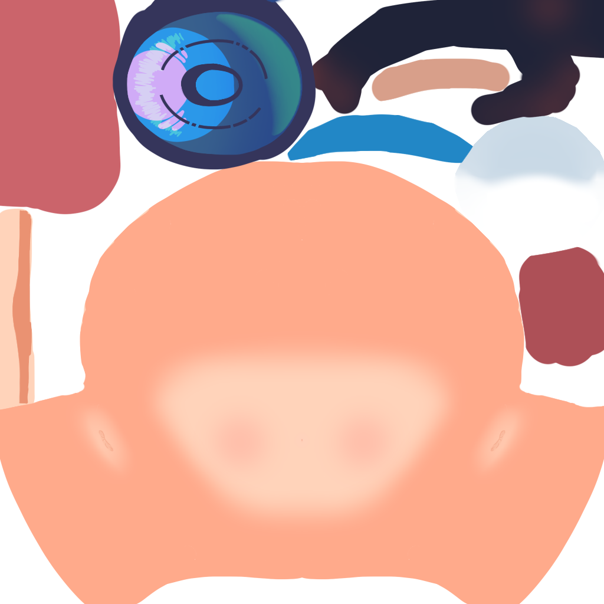
      <code>face.png</code>
    

    

      シェーダー：放射
      色：<code>face.png</code>
      強さ：1.0
    

  

  

    
髪のマテリアル

    

      
      <code>hair.png</code>
    

    

      シェーダー：放射
      色：<code>hair.png</code>
      強さ：1.0
    

  

  

    
服のマテリアル

    

      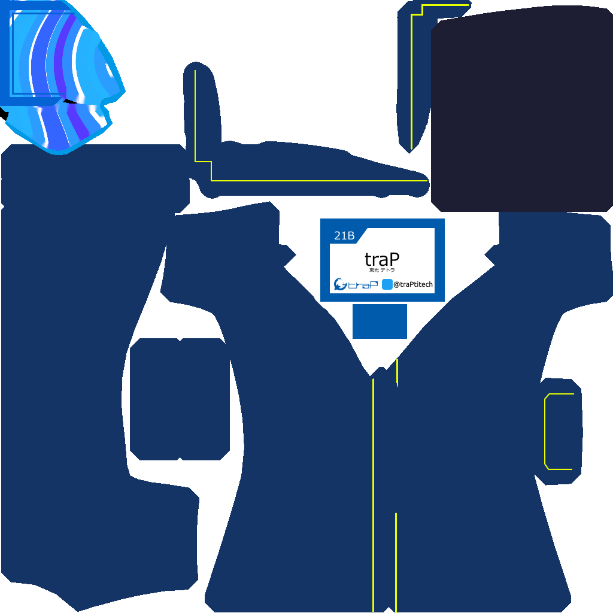
      <code>suit.png</code>
    

    

      シェーダー：放射
      色：<code>suit.png</code>
      強さ：1.0
    

  

マテリアルという箱の中にテクスチャとかシェーダーとか各設定値が入っているイメージ

---

<!-- header: "第二章 3DCGはどう作るの? > 立体物を用意する" -->

# 1. **立体物**を用意する のまとめ

3DCG で描画する"立体物"を**3D モデル**と呼び、これを作成する作業を**3D モデリング**と呼ぶ。
3D モデルは主に以下のような要素で構成される。

- 3D モデル(立体物)
  - ポリゴンメッシュ (形のデータ)
    - 頂点/辺/面 (どこに面があるか、位置のデータ)
    - 法線 (面の向き)
    - UV 座標 (面とテクスチャを対応させる設定)
  - マテリアル (材質の設定)
    - シェーダー (見え方を計算するスクリプト)
    - テクスチャ (画像データ)

---

<!-- header: "第二章 3DCGはどう作るの? > 立体物を動かす" -->

# 2. 立体物を**動かす**

3D モデルを動かすことを**アニメーション**させる と言う

アニメーションの設定には**キーフレームアニメーション**という仕組みを用いる。

---

<!-- header: "第二章 3DCGはどう作るの? > 立体物を動かす > フレーム" -->

<dic class="split-v">

## フレーム

アニメーションは**フレーム**によって表現される。

例えば TV アニメは 1 秒間に 24 枚の画像を素早く切り替えて表示することで動いているように見ている。パラパラ漫画と同じ。
この 1 枚 1 枚の画像をフレームと呼ぶ。

3DCG でもアニメと同様に、複数の画像を素早く切り替えることで動きを表現する。

しかし、動きのフレームの数だけ画像を準備しなければならない。
めんどくさい！大変！

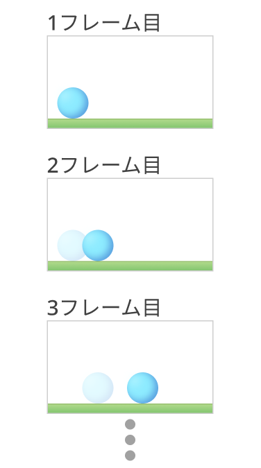

---

<!-- header: "第二章 3DCGはどう作るの? > 立体物を動かす > キーフレームアニメーション" -->

## キーフレームアニメーション:key:

そこで**キーフレームアニメーション**を用いる。

"1 フレーム目ではボールをこっちに置く"、"10 フレーム目ではボールをあっちに置く"
のように、2 つの**重要なフレームだけで**モノの動作を指定する。
この重要なフレームを**キーフレーム**と呼ぶ。

2 ～ 9 フレーム目でのボールの位置はエディタ/ツールがイイ感じに**補間**してくれる。
この仕組みが**キー**(Key(大事な))**フレーム**(だけ指定する)アニメーション。

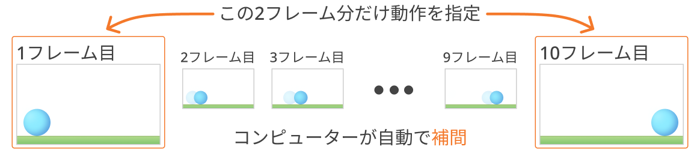

---

<!-- header: "第二章 3DCGはどう作るの? > 立体物を動かす > キーフレームアニメーション > 補間の指定" -->

### 補間の指定

補間は**アニメーションカーブ**(ファンクションカーブとも呼ばれる)で指定する。
時刻に対する状態(位置や回転、大きさなど)を曲線で指定して補間する。

  

    滑らかな入り抜き
    
    
  

  

    直線的な移動
    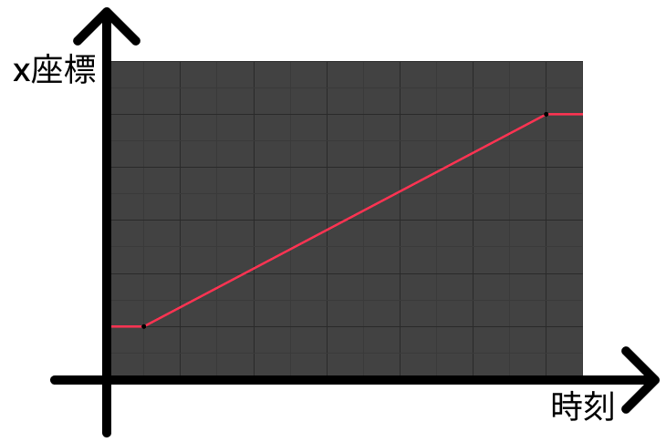
    
  

  

    ばねみたいな移動
    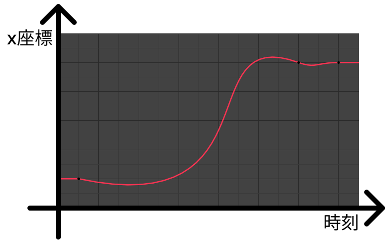
    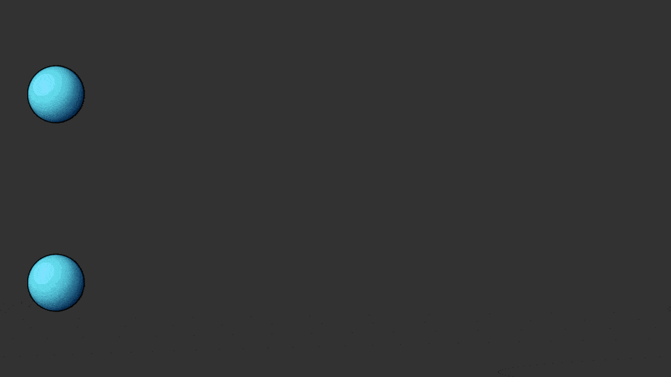
  

---

<!-- header: "第二章 3DCGはどう作るの? > 立体物を動かす > モデルの変形" -->

## モデルの変形

アニメーションの制作過程では、モデルの位置や回転、大きさを変化させる以外にも、モデル自体を変形させたいことがある(というかほぼ確実に必要になる)。
ポリゴンメッシュの変形には**スケルトン**と**ブレンドシェイプ**を用いる。

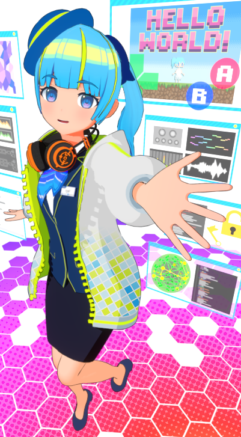

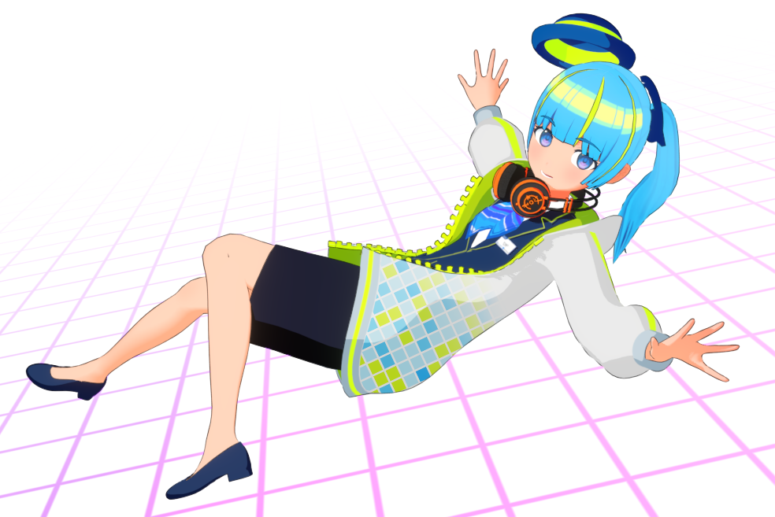

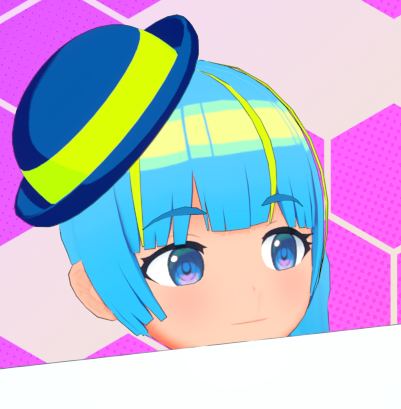

↑ ポーズを変化させたり口の開閉を指せている例(帽子は変形せず、位置と回転を変更しているだけ)

---

<!-- header: "第二章 3DCGはどう作るの? > 立体物を動かす > モデルの変形 > スケルトン" -->

### スケルトン:bone:

アニメーションさせるために、ポリゴンメッシュの頂点 1 つ 1 つの位置変化を細かく指定するのはめんどくさい。

**スケルトン**(skeleton)を用いると、人間や動物、ロボットアーム等、**関節**を持ったポリゴンメッシュを楽に、イイ感じに**変形する**ことができる。

スケルトンは**ボーン**と**ジョイント**で構成された**骨格**のこと。このスケルトンとポリゴンメッシュを**連動させる**(**スキニング**する)ことで、ポリゴンメッシュを変形させることができる。

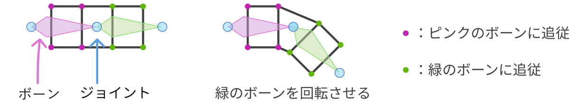

---

<!-- header: "第二章 3DCGはどう作るの? > 立体物を動かす > モデルの変形 > スケルトン > スキンウェイト" -->

#### スキンウェイト

**スキンウェイト**は どの頂点が どのボーンに どれぐらいの割合で 追従するか を決める**重み**

各頂点のスキンウェイトを調整することで、変形の仕方を調整する
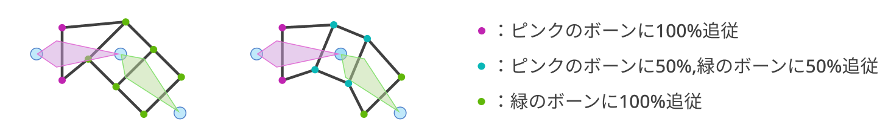

あとは先ほどのキーフレームアニメーションを用いて、"1 フレーム目では腕のボーンをこの角度に..."など指定するとポリゴンメッシュの変形をアニメーションできる

---

<!-- header: "第二章 3DCGはどう作るの? > 立体物を動かす > モデルの変形 > スケルトン > 階層構造" -->

#### 階層構造

スケルトンのボーンとジョイントは**階層構造**を持っている。
**親**に対して移動や回転、拡縮を行うと**子**も**連動**する。
適切に親子関係を設定することで、操作を簡単にできる。

新歓ビライラストでの実例　上腕を回転させるだけで前腕から指先まで連動して動いてくれる。

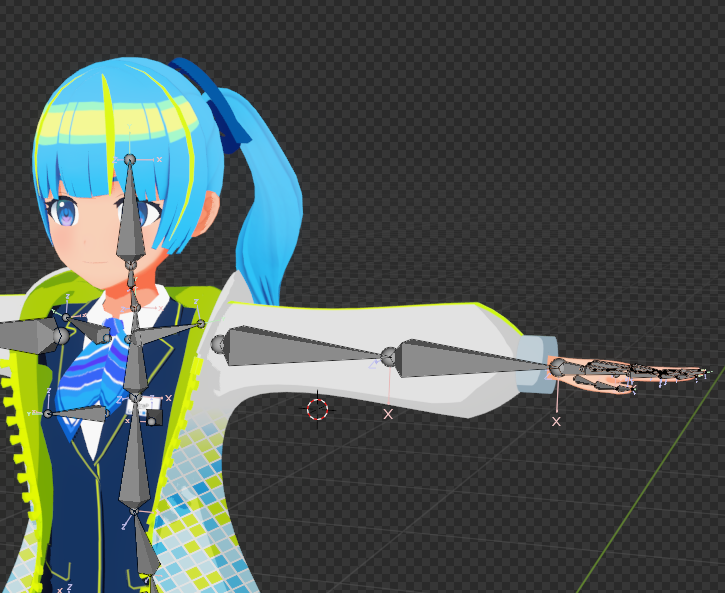

→

省略
└ 左肩
　 └ 上腕
　　 └ 前腕
　　　 └ 掌
　　　　 ├ 親指
　　　　 ├ 人差し指
　　　　 ├ 中指
　　　　 ├ 薬指
　　　　 └ 小指

---

<!-- header: "第二章 3DCGはどう作るの? > 立体物を動かす > モデルの変形 > スケルトン > IK と FK" -->

#### IK と FK

スケルトンは基本的にボーンを回転させることで変形を行うが、回転だけでは難しい表現も多々ある。
そこで**FK**と**IK**という 2 種の制御方法を状況に応じて切り替えて扱う。

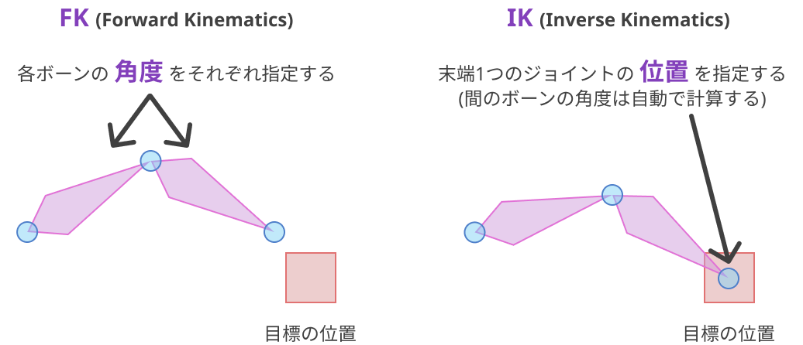

<!-- たとえば「コップを掴む」というアニメーションをさせたいとき、まずてのひらをコップに近づける必要がある。これを表現するのに FK は不向き。なので IK を使う。次に「掴む」動作で各指を曲げる必要があるが、今度は角度で指定したほうが作業しやすい。なので FK を使う。 -->

---

<!-- header: "第二章 3DCGはどう作るの? > 立体物を動かす > モデルの変形 > ブレンドシェイプ" -->

### ブレンドシェイプ

スケルトンを用いた変形が難しい場合は、**ブレンドシェイプ**(blend shape)という手法を用いる。

これはポリゴンメッシュを**頂点単位で変形**させる方法で、キャラクターの表情のアニメーション作成によく使われる。

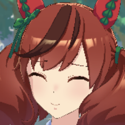

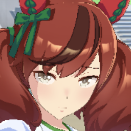

"眉毛を下げる変形"と"目を閉じる変形"と"口を開く変形"を**組み合わせて**表情を作る、といった感じで複数の変形を**ブレンド**して幅広い変形を実現する。

---

<!-- header: "第二章 3DCGはどう作るの? > 立体物を動かす > コントローラー" -->

## コントローラー:video_game:

スケルトンとその IK や FK、ブレンドシェイプによるモデルの変形も、そのままでは扱うのが意外と大変。
実際の現場では、これらをまとめて直感的に操作しやすくする仕組みやインターフェース(**コントローラー**)の作成が行われる。

---

<!-- header: "第二章 3DCGはどう作るの? > 立体物を動かす" -->

# 2. 立体物を**動かす** のまとめ

3D モデルを動かすことを**アニメーション**させると言い、アニメーションは**フレーム**毎に少しずつ画像を変化させることで表現する。

- フレーム (アニメーションの最小単位)
- キーフレームアニメーション (大事な所だけ指定する)
  - 補間の種類 (キーの間の動きの指定)
- モデルの変形
  - スケルトン (骨と関節でできた骨格)
    - スキンウェイト (骨への追従度合)
    - 階層構造 (親と子の連動)
    - FK/IK (角度で制御/位置で制御)
  - ブレンドシェイプ (頂点単位の変形)
- コントローラー (変形を扱いやすくする)

---

<!-- header: "第二章 3DCGはどう作るの? > カメラやライトの準備" -->

# 3. **カメラ**や**ライト**等の準備

立体物の準備ができたら、それを撮影する**カメラ**と、それを照らす**ライト**を用意する。

---

<!-- header: "第二章 3DCGはどう作るの? > 画像に変換する" -->

# 4. **画像**に**変換**する

立体物とライトとカメラの情報から、**コンピューターがひたすら計算**して画像が完成する。

この過程を**レンダリング**(rendering)という。

---

<!-- header: "第二章 3DCGはどう作るの? > 画像に変換する > プリレンダリング" -->

## プリレンダリング

CG を**事前に**レンダリングすることを**プリレンダリング**(pre-rendering)という。
インタラクティブ性が必要ない場面で用いる。
事前にハイスペックなマシンでレンダリングをするので、再生機器のスペックは必要ない(画像/映像の表示さえできればよい)。

例：映画、アニメ、CM、ゲームの挿入映像(プレイヤーは操作できない)

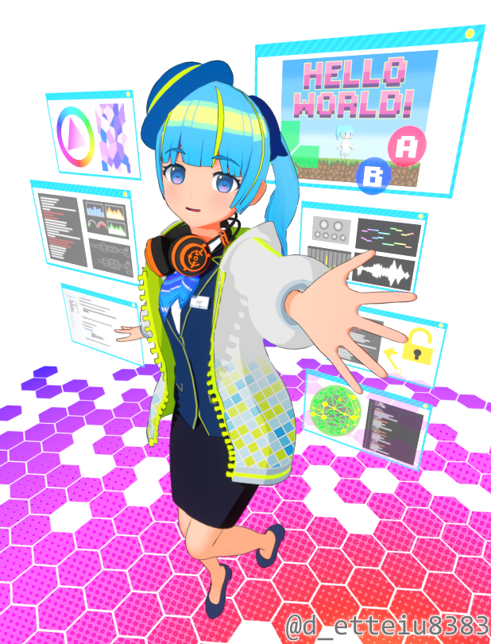

---

<!-- header: "第二章 3DCGはどう作るの? > 画像に変換する > プリレンダリング" -->

## リアルタイムレンダリング

**リアルタイムに**レンダリングして表示することを**リアルタイムレンダリング**(real-time rendering)と呼ぶ。
ユーザーの操作に対して**リアルタイムに内容を変化させたい場合**に用いる。再生機器が自身でレンダリングをする必要がある。
レンダリング時間を短時間で終わらせなければならない(=計算量を減らす必要がある)ので複雑な表現をするには工夫が必要。

例：ゲーム(PC やスマホがレンダリングを行う)、Vtuber の配信(配信者の PC がレンダリングを行う)

<small>
190 人ものアイドルが登場・それぞれが数種類の衣装を所持・最大 15 人のアイドルでライブを行うデレステ

事前に全組み合わせの映像を用意するのは無理
</small>

---

<!-- header: "第二章 3DCGはどう作るの? > エフェクト等で調整" -->

# 5. エフェクト等で**調整**

レンダリング後の出力画像をそのまま使うのではなく、多くの場合はエフェクトを追加したり、別素材と合成する。

プリレンダリングの場合はレンダリング後の画像・映像を**After Effects**というソフトウェアで処理することが多い。
色味の調整やレンズ効果、ブルーム、光芒等の追加などを行う。**ポストエフェクト**と呼ぶことが多い。
他のレンダリング結果との合成、手書きの 2DCG との合成なども行う。合成処理を特に**コンポジット**(composite)と呼ぶ。

リアルタイムレンダリングの場合も同様だが、あまり複雑な処理はできない(After Effects も使えない)。

---

<!-- header: "第二章 3DCGはどう作るの?" -->

# 3DCG は**どう**作るの？ のまとめ

制作の流れの再確認

1. **立体物**を用意する(モデリング)
2. (動画を作る場合は)立体物を**動かす**(アニメーション)
3. **カメラ**や**ライト**等の準備(ライティング)
4. **画像**に**変換**する(レンダリング)
5. エフェクト等で**調整**(コンポジット/ポストエフェクト)

実際の現場ではこれらの各作業を分担している。

まともな作品が完成するまでに必要な工程がめちゃくちゃ多いので一人で 0 から始めるのはかなり大変。作業を簡単にするツールはいっぱいあるので楽をすることを覚えよう。

---

<!-- header: "第三章 3DCGは何で作るの?" -->

# 3DCG は**何で**作るの？

CG(computer graphics)なので**パソコン**で作る。:computer:

3DCG に必要なモノはいっぱい(モデル、マテリアル、テクスチャ、アニメーション、シェーダー、シーンなど)あるので、各データを編集するさまざまなソフトウェアを相手に作業することになる。

モデリングのためのソフトをモデラー、レンダリングのためのソフトをレンダー...みたいに呼ぶ。

ソフトウェアに関しては Wikipedia の[3DCG ソフトウェア](https://ja.wikipedia.org/wiki/3DCG%E3%82%BD%E3%83%95%E3%83%88%E3%82%A6%E3%82%A7%E3%82%A2)のページがめちゃくちゃ参考になるのでぜひ(というか絶対に)読んでほしい。

- 網羅的に紹介されている
- 頻繁に情報が更新されている
- 日本語版 Wikipedia ページ長ランキング第 9 位

---

3DCG 制作ソフトは大きく分けて 2 種類。これらのソフトを適宜使い分けて制作する。

## 統合型ソフト

モデリング、アニメーション、レンダリングなどの**多くの工程をまとめて行える**ソフト

- これ 1 つあればそこそこ制作できる
- 初心者におすすめ
- 一つ一つの機能が低機能でプラグインが必要になることもある

## 特化型ソフト

モデリング、アニメーション、レンダリングなどの各工程**いずれかに特化**したソフト

- 特化している分高性能
- こだわりたい上級者向け
- ソフト間でデータのやり取りが必要になる

---

<!-- header: "第三章 3DCGは何で作るの? > 統合型ソフトの例" -->

## 統合型ソフトの例

### Blender

- **無料**
- 大体全部できる
- 動作が比較的軽い
- ユーザーが多い → 解説記事が豊富
- 最近いろんな企業が使うようになった

「3DCG を始めてみたい！」って人がいたら僕なら迷わず Blender をおすすめします。
まず何より無料である点が強い。「やっぱり辞める」って時に失うものが何もない。

無料であるにもかかわらず、3DCG の始めから終わりまで最低限これ一つで間に合うのも強い。

<!-- Blender：電脳少女シロのモデル作成 -->

### Maya

- **高性能**
- キャラクターアニメーションに強い
- 映画業界とゲーム業界のスタンダード
- ¥286,000/年
- **Pencil+** が強い

### 3ds Max

- Maya と同じ会社(Autodesk)
- プラグインが豊富
- ¥286,000/年
- Windows のみ
- **Pencil+** が強い

<!-- Pencil+：特にライン描画が優秀
Maya：プリキュア、ウマ娘のモデル作成
3ds Max：ゴジラS.P、ガルパンの劇場版など -->

---

## 統合型ソフトの例

### Houdini

- ノードベース
- エフェクト最強
  - 物理シミュレーション
  - パーティクル
- **プロシージャル**モデリングに強い
- 映画・VFX 向き

<!-- Houdini(フーディニ)：群衆シミュレーションなどが強いため映画や VFX で良く使われる -->

### CINEMA 4D

- モーショングラフィックスに強い
- After Effects との連携が強い
- [@ksk_st 加速サトウ](https://twitter.com/ksk_st)氏(AZKi,無頼星れんこの作者)のメインツール

<!-- シネマフォーディー: 加速サトウ：初音ミクがポッキー食べるCM作った人 -->

---

<!-- header: "第三章 3DCGは何で作るの? > 特化型ソフトの例" -->

## 特化型ソフトの例(モデラー)

### ZBrush

- モデラー
- デジタル彫刻ソフト
- **スカルプトモデリング**
- 効率良くデティールの細かいモデル作成

### 3D-Coat

- モデラー&テクスチャ作成
- スカルプトモデリング
- リトポロジーが強い
- UV 展開が強い

### Metasequoia

- モデラー
- 日本生まれ
- MMD やってる人大体これ使ってるイメージ
- 無料版アリ

### Marvelous Designer

- 衣服の作成に特化したモデラー
- 型紙をもとにシミュレーションが行われる

### VRoid Studio

- キャラモデルの制作に特化したモデラー
- 最低限のクオリティのモデルを最短手順で手に入れるならこれ

<!-- ズィーブラシ: スカルプトモデリングと言えばコレ -->
<!-- スカルプトモデリングってなんですか?→ポリゴンモデリングは各頂点や面を指定して形作るのに対し、粘土をこねたり削ったりするように形作っていくのがスカルプトモデリングだと思ってもらえれば大丈夫 -->

---

## 特化型ソフトの例(テクスチャ作成)

### Photoshop

- 画像編集ソフト
- テクスチャ作成に使ってる人が多い

### Substance Painter

- テクスチャ作成ソフト
- 3D モデルに直接色塗りしてテクスチャを作る
- 筆で塗るだけではなく、パーティクルで色塗りできる

### Substance Designer

- テクスチャ作成ソフト
- ノードベースでマテリアルを作成

<!-- Substanceはアドビが買収してる -->

---

## 特化型ソフトの例

### MikuMikuDance

- いわゆる MMD
- アニメーションの作成とレンダリングを行うソフト
  - スケルトンとスキンウェイトの設定が終わっているモデルデータが必要(PMD/PMX)
- 日本の 3D キャラアニメーション文化の発展にめちゃくちゃ影響を与えた
- モーションデータやモデルデータが大量にコミュニティにアップされてる

---

## 特化型ソフトの例(ゲームエンジン)

<!-- ゲームエンジンも立派な3DCGソフトウェア -->

### Unity

- 基本無料
- ゲーム
  - ウマ娘も Unity
- 映像制作にも使われる(魔法使いプリキュア!のエンディング等)
- Vtuber は大体これ

### Unreal Engine

- 基本無料
- 高品質なグラフィックが特徴
- Nanite でハイポリモデルもサクサク描画
- Lumen で動的に変化する光の描画

<!-- Unity: CraftopiaもUnity製 -->

<!-- Unreal Engine: UE5から追加されたルーメンとナーナイトが特徴。ルーメンはリアルタイムに変化するグローバルイルミネーションを可能にしていて、ナーナイトは動的にポリゴンメッシュの分割や削減を行うことで数奥ポリゴンのモデルもサクサク描画できるようになる機能です。 -->

---

<!-- header: "第三章 3DCGは何で作るの?" -->

# 3DCG は**何で**作るの？ のまとめ

様々なソフトウェアを用いて作成する。

各作業工程を一つのソフトでまとめて行えるモノもあれば、各工程に特化したソフトも存在する。制作物に合わせて、これらのソフトを適切に選び、組み合わせて制作を進める。

---

<!-- header: "" -->

# 3DCG 基礎概念講習会のまとめ

- 何ができるの?
  - 立体物から**画像**/**映像**を作る。
  - リアルな画像も嘘の画像も作れる。
  - 幅広く利用されている。
- どう作るの?
  - **モデリング** → **アニメーション** → **レンダリング** → **仕上げ**
- 何で作るの?
  - パソコンで作る。
  - **いろんなソフト**を目的に合わせて使い分ける。

---

<!-- header: "質問対応" -->
<!-- class: QandA -->

# みんなの質問・要望

## 講習会の後にやるべきことを知りたい

### 目標を建てよう

3DCG の利用目的と制作方法は多岐にわたるので、自分がやってみたいことを明確にしてから勉強を始めるのがいいと思います。具体的には

- ゲームを作りたい → 作りたいゲームの方向性を決める → ゲームのプラットフォームを決める →...
- MV を作りたい → 登場するモノを決める(ヒトか？建築物か？植物か？これら全てか？)→ モデラーを決める →...
- 美少女になりたい →webcam?VR?→ モデル作成 →...

「目標は決まったが次に何をやるべきか分からない」→sodan に投げてください

## 初心者でもなにかしっかりとした物が作れる講習会が欲しい

### [初心者向けキャラモデル製作資料(/graphics/modeling/Blender/beginner)](https://wiki.trap.jp/60a9df5a6eb0310016d24210)を用意しました

最低限の操作で最低限の 3DCG を作ることを目標とした資料です(新歓モデリング体験会と同じ資料)。とりあえず形あるモノを作りたい人はこれを参考にしてください。モデリング体験会と同じ内容の講習会もまた今度開催する予定です。

---

## ソフトをどうやって勉強するべきか知りたい

### 網羅的に学ぶ(知る)のが僕は好き

多くの 3DCG 教科書は「キャラクターモデルの制作を通して、各段階で必要になる機能を学ぶ」って感じだと思います。完全に初心者のうちはこれで十分だと思います(こういう記事はネットにいくらでも転がっている)。が、これだけでは完全にオリジナルの創作をしたいときにどのような機能を使っていいのかわからなくなりがちなので、僕個人としては網羅的に勉強するのが好きです。Blender の操作は全てのボタンを一度クリックして機能を知りました。その場で機能を理解できなくても、後々役立つので暇なときに適当なソフトをぽちぽち触るのは有効だと思います。

網羅的に概念を知るという点で[CG 用語辞典 - CGWORLD Entry.jp](https://entry.cgworld.jp/terms/)や[CG 用語辞典 - デジタルハリウッドの専門スクール（学校）](https://school.dhw.co.jp/word/cg/)、[3DCG ソフトウェア - Wikipedia](https://ja.wikipedia.org/wiki/3DCG%E3%82%BD%E3%83%95%E3%83%88%E3%82%A6%E3%82%A7%E3%82%A2)はおすすめ。単語を知っているだけでもソフトウェアの勉強のハードルは下がります。

## 筆を早くする方法を知りたい

### 手の抜き方を知ろう

3DCG はたくさんのソフトウェア・ツールの存在で成り立っている技術です。3DCG を極めることはすなわちソフトの使い方を極めること。ほとんどのソフトはショートカットキーによる操作の高速化や便利なプラグインによる作業の効率化ができます。作業速度の違いはソフトを上手く扱うことができるかどうかの違いであって、デザインや構図で悩み、時間をかけるのはプロも同じだと思います。さまざまなツールでの手の抜き方を知ることが大事。
[#team/graphics/modeling/article](https://q.trap.jp/channels/team/graphics/modeling/article)も要チェック。

---

## トポロジーの流れの作り方・考え方を知りたい/きれいなポリゴンメッシュのつくり方を知りたい

### ひたすら好きな作品を眺めよう

**トポロジー**とはポリゴンメッシュにおける面・辺のつなげ方のこと。「絶対にこうするべき！」という決まりは無いので、気に入ったモデルをひたすら眺めて、共通したトポロジーの流れを見つけるのが上達の近道だと思います。暇なときに[ニコニ立体](https://3d.nicovideo.jp/)や[sketchfab の週間人気モデル](https://sketchfab.com/3d-models/popular)を眺めよう。

ニコニ立体ならホロライブメンバーと 774inc.の公式 MMD モデルがおすすめ。

## 普段どこで 3DCG に関する情報を得ているか

### Twitter と[#team/graphics/modeling/article](https://q.trap.jp/channels/team/graphics/modeling/article)

traQ の[#team/graphics/modeling/article](https://q.trap.jp/channels/team/graphics/modeling/article)に 3DCG 系の良記事が勝手に流れてくるので普段僕はここから情報を得ています。3DCG は各個人の絵心も重要ですが、それよりも「知っているかどうか」が大事だと思っています。先ほども言いましたが 3DCG を極めることはすなわちソフトの使い方を極めること。知っている/使えるソフトの幅は創作の幅に直結します。特に便利なのが 2D／3DCG・VR・ツール・ニュース情報サイトの[3D 人-3dnchu-](https://3dnchu.com/)です。いろんなツールやソフトの情報はもちろん、チュートリアルの紹介やイベント情報がほぼ毎日配信されているので要チェック。
あとは Twitter で好きなクリエイターをフォローしておけば完璧。

Blender の教科書的な物はほとんど読んだ事ない(Maya の教科書は持ってるけどネットで済んでる)。
[CGWORLD](https://shop.cgworld.jp/)は好きなコンテンツの話が特集されてたら買っている[(booQ にあります)](https://booq.trap.jp/users/d_etteiu8383)。
ゲームやアニメなど企業のお仕事テクニックはやはりお金を払わないと見せてくれない。

---

## ローポリモデルのつくり方を知りたい

### 慣れるしかないと思う... ⇒ 256fes だ！！！

ローポリモデル(Low Polygon Model) = 面の数が少ないモデル
面が少ない → 描画時間が短く済む → ハードウェアの性能が低くても表示できる
古いゲームではいかに少ないポリゴンでいかに表現するかが大事だったりした。
...が、近年のハードウェアはよっぽどポリゴン数の多いモデルでもなければ普通に表示できるので、ローポリは表現の一つとして扱われるのがメイン。
ローポリ作成は慣れだと思います...ので、部内 256fes で勉強しましょう。

2 年前に作った鴨パーカー
約 1000△

## ノードエディタの使い方を知りたい

### 慣れるしかないと思う... ⇒ 需要あるなら勉強会やる

**ノードベース**は、"なんらかの処理"を行う複数の**ノード**をつなげて複数の処理を順番に実行するような仕組み。

僕は完全に慣れで習得したので言語化が難しい。...ので、講習会や勉強会を開催したいと思います。

---

## blender にも freestyle って輪郭描画機能あるっぽいけど、pencil+との比較とか気になる

### freestyle も設定がめんどくさいけど頑張ればめっちゃイイ感じにできる

blender にも freestyle と呼ばれるライン描画機能があります。これは設定項目がかなり面倒で、始めはめちゃくちゃ制御が難しいですが、慣れればそこそこのものができます。

新歓ビライラストの輪郭線も freestyle で描画しています。

---

## d_etteiu8383 がこれまでどんなことをしてきたか、したいか

### 『かわいくてかっこいい』を作りたい/なりたい

- ～ 2011 年 ひたすらゲームしてひたすらお絵描きしてた。
- 2012 年 アニメ『スマイルプリキュア！』のエンディング映像を見て 3DCG に感動する
- 2013 年～ 2016 年 インターネットに入り浸る/プログラミングの雰囲気を知る
- 2017 年 スマホと PC を購入
- 2018 年 3DCG の勉強開始/Vtuber の台頭
- 2019 年 東工大合格と traP 入部
- これから: traP における 3DCG 系活動の地盤を固める&トゥーン表現を主に VR コンテンツとアニメーションの作成をしたい

きっかけがプリキュアなのでアニメチックな表現に興味がある&かわいいを極めたい

<!-- 2012: 漠然とデジタルなモノづくりをしたいと考え始める(この頃は主に「ゲームを作りたい！」って感じだった)。 -->
<!-- 2013~: 特にニコニコの技術部と MMD を見ていた
PSVitaでインターネット
『リトルビッグプラネット』というゲームにはまる(ノードベースのエディタに慣れる)
プログラミングをちょっとだけ勉強(PC 未所持) -->
<!-- 2017: デレステを始める(キャラモデリングに興味を持つ) -->
<!-- 2018: 一番の変化の年
2018年の前半から3DCGの勉強は何となくしていたが、受験勉強が合って集中していなかった
が、2018年の夏にVtuberの春瀬ぽぽを見たのがきっかけで3DCGの勉強を何よりも優先した
Maya の学生無償版
Vtuber が流行り始めて資料も多くなった
(コイカツのmod作成で 3DCG のお気持ちを学ぶ)
-->
<!-- これからやりたいことは2つあって、まず一つはtraPの3DCG力を高めたいです。入部した後に「traPって意外とキャラモデリングやってる人」いないなって思って、wikiにそのあたりあまり記事が無いので今年特にこの地盤を固めるって言うことをメインにしたいと思っています。新歓ビラで3DCGを利用したのもその一つです。
また、制作としてはトゥーン表現にもっと強くなりたいです。 -->
